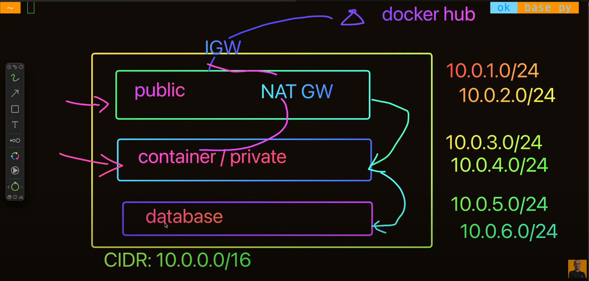

# Networking

Most of the topics are coverd in below reference:

- TCP/IP, OSI Model, IP Address Scheme, Subnet masks, Sockets - Port numbers, DNS - DNS server, Routing, Ipv6

Ref: https://www.youtube.com/watch?v=n7Quap-ysak&list=PLQd3D0Eos95dYJaQ0u9tiE5hjlyJEM_QY&index=18

- Know about Network components: Router, Switch, NAT, SSL Handshake, TCP/UDP protocol, TTL, DHCP, Private/Public IP address, Mac address
- Know about Network flow: Inbound/outbound traffic, Bandwidth, Latency, ...
- Know about Network security: NACL, Firewall,...

## How do Devops engineers use netwrking knowledge in their work?

- Desgining and deploying scalable and reliable (chắc chắn, đáng tin cậy) networks
- Automating network task
- Troubleshoot network problems

## Networking in ECS

**Classless Inter-Domain Routing (CIDR)** is an IP address allocation method that improves data routing efficiency on the internet. Every machine, server, and end-user device that connects to the internet has a unique number, called an IP address, associated with it. Devices find and communicate with one another by using these IP addresses. Organizations use CIDR to allocate IP addresses flexibly and efficiently in their networks.

Ref:

- https://aws.amazon.com/what-is/cidr/
- https://docs.aws.amazon.com/vpc/latest/userguide/subnet-sizing.html

